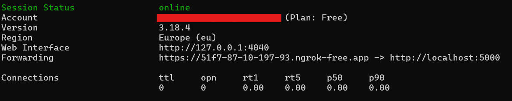
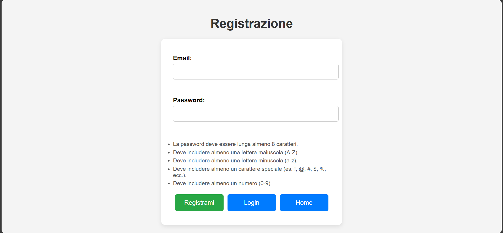
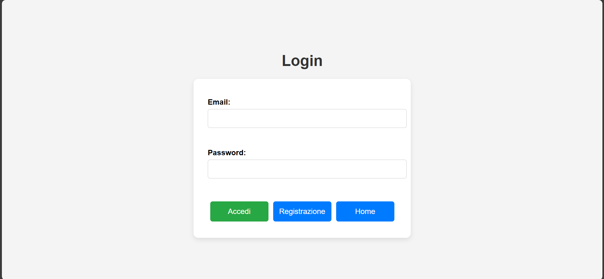
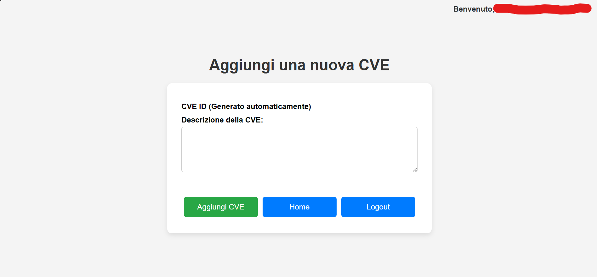
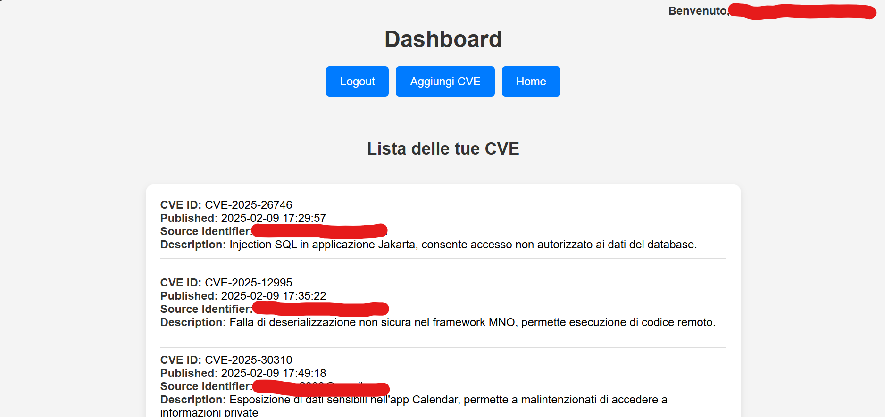

# Documentazione Sicurezza delle Architetture Orientate ai Servizi

# CVE Tracker

### Studente: Visci Nicolas

Il progetto ha previsto la realizzazione di una Web app che permette la visualizzazione tramite l'API del National Institute of Standards and Technology (NIST), delle prime 50 CVE pubblicate nel 2025. Tramite autenticazione con Token JWT, è permesso aggiungere nuove CVE.
La sicurezza del servizio implementato è garantita dall'utilizzo di Protocollo HTTPS, sul quale i dati viaggiano cifrati, e l'utilizzo di Token JWT per garantire l'autenticità degli utenti.

## Principali Tecnologie utilizzate

- MySQL Database
- PyCharm / Python
- HTML / CSS /Javascript
- Flask
- Ngrok

## Architettura del servizio

L'architettura REST è uno stile architetturale per progettare servizi web. Si basa su principi e vincoli che garantiscono semplicità, scalabilità e interoperabilità tra sistemi.

## Passi per l'installazione

Scaricare il progetto ed importarlo in un ambiente di sviluppo (es. Pycharm).

Seguire i seguenti passaggi:

1. **Installazione requirements:**
Installare tutte le librerie specificate nel file `requirements.txt`

2. **Avviare MySQL Database:** 
Se non avviato in automatico, aprire un terminale con funzioni di amministratore e lanciare il comando `net start mysql80` 

3. **Avviare server ngrok:**
Installato correttamente, eseguiamo il comando `ngrok http 5000`

4. **Avviare Web App**
Eseguiamo la Web App all'interno dell'ambiente di sviluppo.

## Configurazione ambiente - Ngrok

Ngrok è uno strumento che consente di esporre server o applicazioni in esecuzione localmente su internet tramite un tunnel sicuro. 
È particolarmente utile durante lo sviluppo per testare servizi.

Caratteristiche principali:
- Fornisce un URL pubblico, accessibile da qualsiasi dispositivo connesso a internet, che inoltra le richieste al server locale.
- Supporta connessioni HTTPS, garantendo che i dati inviati attraverso il tunnel siano protetti durante il transito.
- Semplice da configurare e funziona senza modificare il firewall o la rete.

<h3>ISTRUZIONI PER INSTALLARE E CONFIGURARE NGROK:</h3>

1. Visitare il sito: https://ngrok.com/ e registrarsi.
 
Dopo la registrazione su ngrok, viene fornito un Authtoken (un codice alfanumerico unico). Questo token serve per autenticare l'utente e abilitare l'accesso alle funzionalità di ngrok, come l'utilizzo di URL persistenti o altre opzioni avanzate.

2. Scaricare l'eseguibile ngrok.exe ed aggiungerlo alle variabili d'ambiente in modo da poter eseguire i comandi successivi senza problemi:
  - Aggiungere il percorso di ngrok.exe manualmente alle variabili di ambiente Path,
  - in alternativa, aprire il prompt dei comandi windows e digitare
    `setx /M PATH "%PATH%;<PATH_TO_NGROK>"`  ad esempio :
    `setx /M PATH "%PATH%;C:\tools\ngrok"`

3. Dopo aver aggiunto ngrok alle variabili d'ambiente, configurarlo con il token ottenuto durante la fase di registrazione, eseguire quindi il seguente comando:
`ngrok config add-authtoken <YOUR_AUTHTOKEN>`

4. Per avviare il servizio di esposizione sulla porta 5000 eseguire sul prompt:
`ngrok http 5000`

5. Una volta avviato il servizio si otterrà una schermata tipo:
   

   
<b>ATTENZIONE:</b> Ogni volta che ngrok viene interrotto, bisogna rieseguire il comando del <b>punto 4</b>

## Configurazione MySQL Database

MySQL è un sistema di gestione di database relazionale (RDBMS) basato sul linguaggio SQL (Structured Query Language). È noto per la sua velocità, affidabilità e facilità d'uso, ed è ampiamente utilizzato per applicazioni web, software aziendali e soluzioni di archiviazione dati. MySQL supporta diverse architetture, ed include funzionalità di sicurezza avanzate.

<h3> QUERY </h3>

Le query in MySQL sono istruzioni SQL utilizzate per interagire con il database, consentendo operazioni come l'inserimento, la modifica, l'eliminazione e il recupero dei dati. Le principali tipologie di query includono:  

- **SELECT**: per recuperare dati da una o più tabelle.  
- **INSERT**: per aggiungere nuovi record.  
- **UPDATE**: per modificare dati esistenti.  
- **DELETE**: per rimuovere record.  

<b> CONFIGURAZIONE DATABASE:</b>

Una volta installato correttamente MySQL, eseguiremo i seguenti comandi per la configurazione del Database.

- CREAZIONE DEL DATABASE soas: 

` CREATE DATABASE soas;`

- CREAZIONE DELLA TABELLA users:

`
CREATE TABLE users (
    id INT AUTO_INCREMENT PRIMARY KEY,
    email VARCHAR(255) NOT NULL UNIQUE,
    password VARCHAR(255) NOT NULL
);
`
- CREAZIONE DELLA TABELLA cvelist: 

` 
    CREATE TABLE cvelist ( 
    id INT AUTO_INCREMENT PRIMARY KEY,
    cveid VARCHAR(50) NOT NULL UNIQUE,
    published DATETIME(3) DEFAULT CURRENT_TIMESTAMP(3),
    sourceIdentifier VARCHAR(255) NOT NULL,
    description TEXT NOT NULL
);
`

Infine, creare un file `.env` nella cartella principale del progetto che contenga le informazioni relative al proprio Database.

## Flask

Flask è un framework web leggero, più precisamente un microframework, open-source per il linguaggio di programmazione Python. È progettato per facilitare la creazione di applicazioni web, offrendo gli strumenti di base necessari per gestire richieste HTTP, routing, gestione delle sessioni e rendering di template.

Flask è particolarmente utile per:

- <b>Sviluppare API web:</b> grazie alla sua semplicità e flessibilità è molto usato per costruire API RESTful.
- <b>Creare siti web dinamici:</b> Consente di generare pagine web dinamiche, interagendo con il database, gestendo la logica di business e rendendo il contenuto personalizzato per gli utenti.

Vantaggi nell'utilizzo di Flask

- <b>Flessibilità:</b> Essendo un microframework, Flask non impone una struttura rigida e consente agli sviluppatori di scegliere le librerie o gli strumenti che meglio si adattano al progetto. È possibile aggiungere facilmente estensioni per funzionalità come la gestione delle sessioni, la convalida dei moduli e l'autenticazione.

- <b>Scalabilità:</b> Sebbene sia un framework leggero, Flask è abbastanza scalabile per supportare applicazioni più complesse. Può essere utilizzato per progetti di piccole dimensioni così come per applicazioni più grandi, con una gestione del codice che resta relativamente semplice.

## Diagramma delle Architetture - Da completare

## Funzionalità sviluppate e Controlli di Sicurezza

### REGISTRAZIONE e LOGIN

Per aggiungere una nuova CVE a quelle già presenti, bisogna aver effettuato l'accesso. Se non si è registrati si può farlo inserendo una email (non utilizzata da altri) e una password che rispetti gli standard comuni (minimo 8 caratteri, almeno una lettera minuscola, una lettera maiuscola, un numero e un carattere speciale). Al termine della registrazione, se avvenuta con successo, si potrà effettuare il login con le nuove credenziali.

Se si è già registrati, si può accedere, tramite login, alla propria Dashboard per visualizzare, se presenti, le CVE caricate con il proprio indirizzo mail.
Verificato che l'utente esiste, ed effettuato con successo il login, viene creato un JWT (JSON Web Token) con l'email dell'utente e il TIMESTAMP del momento in cui avviene l'accesso. Il Token viene salvato in maniera sicura, garantendo l'integrità del Token.  

### AGGIUNTA CVE

Verificata la presenza del Token e previa validazione dello stesso, l'utente autenticato correttamente può inserire in un apposito Form il testo che descrive la CVE che vuole aggiungere.
Il testo inserito, prima del salvataggio sul Database, viene sanificato attraverso la libreria 'Bleach', in modo da evitare l'esecuzione di codice dannoso.

### DASHBOARD

Effettuato il login con successo, si potranno visualizzare le proprie CVE aggiunte con il proprio indirizzo mail, scegliendo eventualmente di aggiungerne altre.

### LOGOUT

La funzione di 'logout' gestisce la disconnessione dell'utente rimuovendo il Token JWT salvato nei Cookie.
Il Cookie dell'utente autenticato, verrà invalidato, e l'utente riceverà un messaggio di conferma. Terminata con successo la fase di logout, l'utente dovrà rieffettuare l'accesso tramite la pagina di login.

---

**Sicurezza dei Cookie** 🍪

Il token JWT viene salvato in un cookie HTTP-only, impedendo l'accesso al token da parte di JavaScript e proteggendolo da attacchi XSS (Cross-Site Scripting).
Il token è impostato con scadenza automatica dopo 20 min, riducendo il rischio di sessioni persistenti non autorizzate.

**Protezione da SQL Injection** 🔐

Tutte le query SQL usano query parametrizzate (%s in `cursor.execute()`), evitando l'inserimento diretto di dati utente nelle query SQL.
Questo impedisce di iniettare codice SQL per accedere o manipolare il database.

**Mitigazione di XSS (Cross-Site Scripting)** 🛡️

Per evitare che l'utente possa inviare tramite il form per l'aggiunta di CVE, degli input malevoli (come script per l'XSS), prima di salvare il contenuto nel database e visualizzarlo nella dashboard, viene sanificato andando a rimuovere tutti i possibili caratteri potenzialmente pericolosi.

## Fonti e Riferimenti

- ngrok - https://ngrok.com/

- Flask - https://flask.palletsprojects.com/en/stable/

- JWT - https://www.ionos.it/digitalguide/siti-web/programmazione-del-sito-web/json-web-token-jwt/